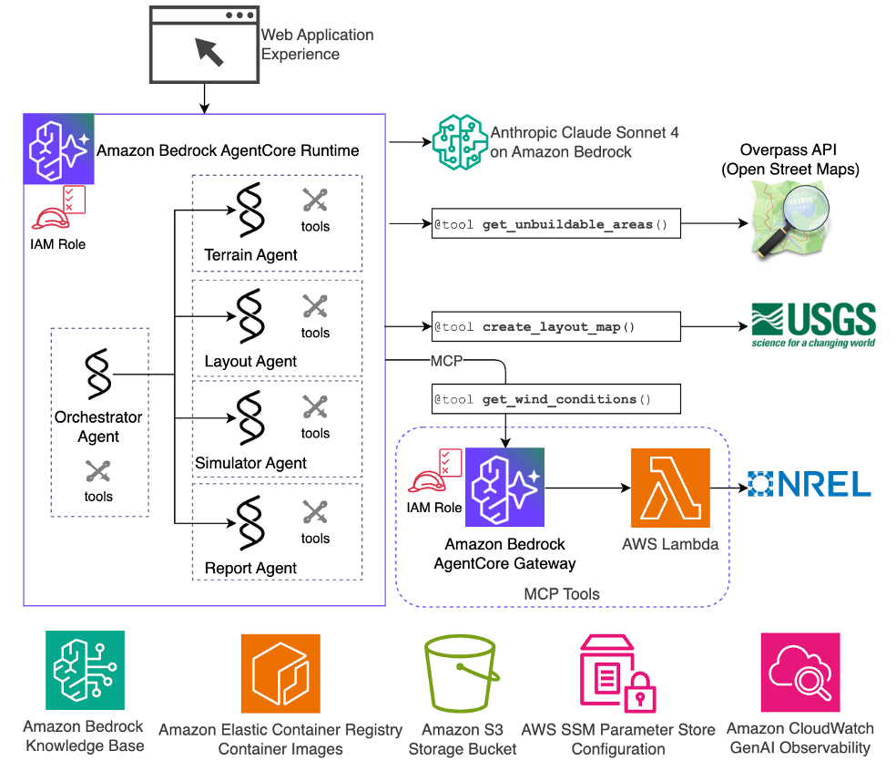

# Wind Farm Planning Assistant

An AI-powered multi-agent system for comprehensive wind farm development, from site analysis to energy production simulation.

## Overview

This project provides specialized AI agents that work together to analyze terrain, design optimal turbine layouts, and simulate wind farm performance using Amazon Bedrock and advanced wind modeling tools.

## Features

- **🗺️ Terrain Analysis**: Identify un-buildable areas and exclusion zones
- **📐 Layout Optimization**: Design optimal turbine placements with safety setbacks
- **⚡ Energy Simulation**: Calculate annual energy production and wake effects
- **📊 Executive Reports**: Generate comprehensive analysis reports with visualizations

## Architecture



### Agents

- **Terrain Analysis Agent**: Analyzes geographic constraints and exclusion zones
- **Layout Agent**: Designs optimal turbine layouts considering terrain and regulations
- **Simulation Agent**: Performs wake modeling and energy production calculations
- **Report Agent**: Generates executive summaries and visualizations
- **Multi-Agent**: Orchestrates the complete workflow

### Web Application

The web application is implemented with Python FastAPI and React frontend, and is deployed separately from the agents and tools.

This is a sample frontend demonstrating agent interactions in the user interface, it does not implement project management and authentication/authorization features required for a production application.

We recommend you to implement your own web experience with your desired authentication and authorization mechanisms.

### Key Technologies

- **Amazon Bedrock**: Claude Sonnet 4 for AI reasoning
- **Amazon Bedrock AgentCore**: Secure scalable runtime for agent deployment
- **Strands Agents**: Agent development framework
- **MCP (Model Context Protocol)**: Tool integration
- **PyWake**: Advanced wake modeling and yield simulation
- **Folium/GeoPandas**: Geo-spatial visualization

## Project Structure

```sh
root/
├── agents/                      # AI agent implementations
│   ├── prompts/                 # System prompts used by the agents
│   ├── tools/                   # Agent-specific tools
│   ├── terrain_agent.py
│   ├── layout_agent.py
│   ├── simulation_agent.py
│   └── reporting_agent.py
├── mcp_tools/                   # MCP server for tool integration
└── web_app/                     # Web application interface
```

## Example Workflow

1. **Terrain Analysis**

   ```text
   Analyze terrain at 35.067482, -101.395466 with turbine model "IEA_Reference_3.4MW_130"
   ```

2. **Layout Design**

   ```text
   Design a 30MW wind farm at location lat:35.067482, lon:-101.395466 using IEA_Reference_3.4MW_130 turbines for project_id 1111_2222
   ```

3. **Energy Simulation**

   ```text
   Run wake simulation for the layout with wind conditions 
   at coordinates 35.067482, -101.395466
   ```

4. **Report Generation**

   ```text
   Generate executive report with charts and recommendations
   ```

## Deployment

The project uses AWS SAM (Serverless Application Model) for infrastructure deployment.

### Prerequisites

- AWS Account with appropriate permissions
- AWS CLI configured
- SAM CLI installed
- Docker for building container images

### Recommendations

This sample does not implement authentication and authorization mechanisms and guardrails for LLM interactions. These should be implemented according to each organization's requirements.

- Use Amazon Bedrock Guardrails to protect against LLM based threats
- Use Amazon Cognito or other authentication mechanisms for user management and authorization for web application

### Clone the repository

```bash
# Clone the repository
git clone <repository-url>
```

### Environment Variables

Following environment variables are required:

- `AWS_REGION`: Target AWS region (this sample supports us-west-2 region)
- `AWS_ACCOUNT_ID`: Your AWS account ID
- `AWS_ROLE_NAME`: IAM role for GitHub Actions OIDC
- `OVERPASS_API_URL`: Overpass API Url - see docs at: [OpenStreetMap Wiki](https://wiki.openstreetmap.org/wiki/Overpass_API)
- `NREL_API_BASE_URL`: NREL API base URL - see docs at: [NREL Developer Docs](https://developer.nrel.gov/docs/)
- `NREL_API_KEY`: NREL API key - you can obtain one at: [NREL Developer Portal](https://developer.nrel.gov/signup/)
- `NREL_API_EMAIL`: NREL API email you used to register for the API key

### Manual Deployment

To deploy manually, replace the environment variable values and execute the following commands:

```bash

# Set environment variables
export AWS_REGION=us-west-2
export AWS_ACCOUNT_ID=<your-account-id>
export OVERPASS_API_URL=<overpass-api-url>
export NREL_API_BASE_URL=<base-url>
export NREL_API_KEY=<your-api-key>
export NREL_API_EMAIL=<your-email>

# Login to ECR
aws ecr get-login-password --region $AWS_REGION | docker login --username AWS --password-stdin $AWS_ACCOUNT_ID.dkr.ecr.$$AWS_ACCOUNT_ID.amazonaws.com

# Create ECR repositories
aws ecr create-repository --repository-name wind-dev-agent --region $AWS_REGION || true
aws ecr create-repository --repository-name wind-tools-lambda-image --region $AWS_REGION || true
aws ecr create-repository --repository-name wind-farm-app --region $AWS_REGION || true

# Build and push container images
docker build -t $AWS_ACCOUNT_ID.dkr.ecr.$AWS_REGION.amazonaws.com/wind-dev-agent:latest ./agents --platform linux/arm64 --push
docker build -t $AWS_ACCOUNT_ID.dkr.ecr.$AWS_REGION.amazonaws.com/wind-tools-lambda-image:latest ./agents --platform linux/arm64 --provenance=false --push
docker build -t $AWS_ACCOUNT_ID.dkr.ecr.$AWS_REGION.amazonaws.com/wind-farm-appe:latest ./agents --platform linux/amd64 --push

# Deploy with SAM
sam deploy --parameter-overrides \
  ParameterKey=AgentImageUri,ParameterValue=<account-id>.dkr.ecr.<region>.amazonaws.com/wind-dev-agent:latest \
  ParameterKey=ToolImageUri,ParameterValue=<account-id>.dkr.ecr.<region>.amazonaws.com/wind-tools-lambda-image:latest \
  ParameterKey=AppImageUri,ParameterValue=<account-id>.dkr.ecr.<region>.amazonaws.com/wind-farm-app:latest \
  ParameterKey=OverpassApiUrl,ParameterValue=$OVERPASS_API_URL \
  ParameterKey=NrelApiBaseUri,ParameterValue=$NREL_API_BASE_URL \
  ParameterKey=NrelApiKey,ParameterValue=$NREL_API_KEY \
  ParameterKey=NrelApiEmail,ParameterValue=$NREL_API_EMAIL \
  --capabilities CAPABILITY_IAM

```

### Automated Deployment via Github Actions

Refer to the [Github Actions Workflow](.github/workflows/ci.yml) for automated deployment. Note that this requires you to create repository environment variables referred in the workflow.

## 📄 License

This project is licensed under the MIT License - see the LICENSE file for details.

## 🙏 Acknowledgments

- **NREL** for wind resource data and turbine data
- **OverpassAPI** and OpenStreetMaps for the map features
- **PyWake** for wake modeling capabilities
- **Strands SDK** for multi-agent framework
- **Amazon Bedrock** for AI inference
- **Amazon Bedrock AgentCore** for AI Agent deployment
- **USGS/ArcGIS** for satellite imagery
