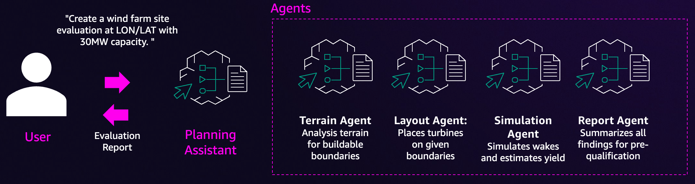
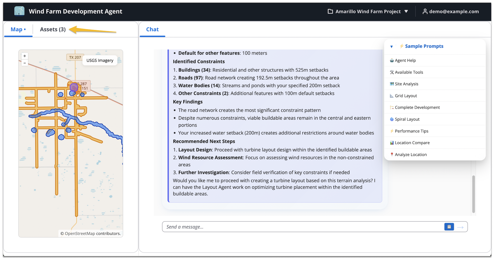

# Wind Farm Planning Assistant

An AI-powered multi-agent system with specialized agents that work together to analyze terrain, design optimal turbine layouts, and simulate wind farm performance using Amazon Bedrock and advanced wind modeling tools.

## Table of Contents

- [Features](#features)
- [Agents](#agents)
- [Architecture](#architecture)
- [Project Structure](#project-structure)
- [Deployment](#deployment)
- [Additional Resources](#additional-resources)
- [Acknowledgements](#acknowledgments)


## Features

- **Intelligent Terrain Analysis**: Automated geographic constraint analysis with buildable land identification
- **Optimal Layout Design**: AI-driven turbine placement considering spacing and terrain requirements
- **Advanced Wake Modeling**: PyWake-powered energy production simulations
- **Executive Reporting**: Automated report generation with visualizations and recommendations
- **Multi-Agent Orchestration**: Coordinated workflow management across specialized agents
- **Deployment in Amazon Bedrock AgentCore**: Deployment of agents in AgentCore Runtime and MCP server in AgentCore Gateway
- **Front-end webapp**: Chat interface with interactive maps and charts and thought tracing

## Agents

- **Planning Assistant**: Orchestrates the complete workflow
- **Terrain Analysis Agent**: Analyzes geographic constraints and provides GeoJSON of buildable land
- **Layout Agent**: Places turbines while considering terrain and spacing requirements
- **Simulation Agent**: Performs wake modeling and energy production calculations
- **Report Agent**: Generates executive summaries and visualizations



### Example Workflow

1. **Terrain Analysis**

   ```text
   Analyze terrain at 35.067482, -101.395466 with turbine model "IEA_Reference_3.4MW_130. Use a setback from roads of 1.2 * turbine height."
   ```

2. **Layout Design**

   ```text
   Design a 30MW wind farm at location lat:35.067482, lon:-101.395466 using IEA_Reference_3.4MW_130 turbines.
   ```

3. **Energy Simulation**

   ```text
   Run wake simulation for the layout with wind conditions 
   at coordinates 35.067482, -101.395466
   ```

4. **Report Generation**

   ```text
   Generate executive report with charts and recommendations
   ```

5. **Full Workflow**

   ```text
   Run through the full workflow required to design a 30MW wind farm at location lat:35.067482, lon:-101.395466 using IEA_Reference_3.4MW_130 turbines and output a report with all findings and simulation results.
   ```

## Architecture


### Web Application

The web application is implemented with Python FastAPI and React frontend, deployed separately from the agents and tools.

> **Note**: This is a sample frontend demonstrating agent interactions. It does not implement project management, authentication, or authorization features required for production use. Implement your own web experience with appropriate security mechanisms.




### Key Technologies

- **Amazon Bedrock**: Claude Sonnet 4 for AI reasoning
- **Amazon Bedrock AgentCore**: Secure scalable runtime for agent deployment
- **Amazon S3 Vectors**: Knowledge base using object storage
- **Strands Agents**: Agent development framework
- **MCP (Model Context Protocol)**: Tool integration
- **PyWake**: Advanced wake modeling and yield simulation
- **Folium/GeoPandas**: Geo-spatial visualization

## Project Structure

```sh
root/
├── agents/                      # AI agent implementations
│   ├── prompts/                 # System prompts used by the agents
│   ├── tools/                   # Agent-specific tools
│   ├── terrain_agent.py
│   ├── layout_agent.py
│   ├── simulation_agent.py
│   └── reporting_agent.py
├── mcp_tools/                   # MCP server for tool integration
└── web_app/                     # Web application interface
```


## Deployment

The project uses AWS SAM (Serverless Application Model) for infrastructure deployment.

### Prerequisites

- **AWS Account** with appropriate permissions 
- **[AWS CLI](https://docs.aws.amazon.com/cli/latest/userguide/cli-chap-configure.html)** configured
- **[AWS SAM CLI](https://docs.aws.amazon.com/serverless-application-model/latest/developerguide/install-sam-cli.html)**  installed
- **[Docker](https://www.docker.com/get-started/)** for building container images

### Security Recommendations

> **⚠️ Important**: This sample does not implement authentication, authorization, or LLM guardrails. Implement these according to your organization's requirements before production use.

**Recommended security measures:**
- **Amazon Bedrock Guardrails**: Protect against LLM-based threats
- **Amazon Cognito**: User management and authorization
- **VPC Configuration**: Network isolation for sensitive workloads
- **IAM Least Privilege**: Minimal required permissions
- **API Rate Limiting**: Prevent abuse and control costs

### Environment Variables

Create a `.env` file with the following required variables:

- `AWS_REGION`: Target AWS region (this sample supports us-west-2 region)
- `AWS_ACCOUNT_ID`: Your AWS account ID
- `AWS_ROLE_NAME`: IAM role for GitHub Actions OIDC
- `OVERPASS_API_URL`: Overpass API instance Url - see docs at: [OpenStreetMap Wiki](https://wiki.openstreetmap.org/wiki/Overpass_API#Public_Overpass_API_instances)
- `NREL_API_BASE_URL`: NREL API base URL - see docs at: [NREL Developer Docs](https://developer.nrel.gov/docs/)
- `NREL_API_KEY`: NREL API key - you can obtain one at: [NREL Developer Portal](https://developer.nrel.gov/signup/)
- `NREL_API_EMAIL`: NREL API email you used to register for the API key

### Manual Deployment


Replace the environment variable values and execute the following commands:

```bash

# Set environment variables
export AWS_REGION=us-west-2
export AWS_ACCOUNT_ID=<your-account-id>
export OVERPASS_API_URL=<overpass-api-url>
export NREL_API_BASE_URL=<base-url>
export NREL_API_KEY=<your-api-key>
export NREL_API_EMAIL=<your-email>

# Login to ECR
aws ecr get-login-password --region $AWS_REGION | docker login --username AWS --password-stdin $AWS_ACCOUNT_ID.dkr.ecr.$AWS_REGION.amazonaws.com

# Create ECR repositories
aws ecr create-repository --repository-name wind-dev-agent --region $AWS_REGION || true
aws ecr create-repository --repository-name wind-tools-lambda-image --region $AWS_REGION || true
aws ecr create-repository --repository-name wind-farm-app --region $AWS_REGION || true

# Build and push container images
docker build -t $AWS_ACCOUNT_ID.dkr.ecr.$AWS_REGION.amazonaws.com/wind-dev-agent:latest ./agents --platform linux/arm64 --push
docker build -t $AWS_ACCOUNT_ID.dkr.ecr.$AWS_REGION.amazonaws.com/wind-tools-lambda-image:latest ./agents --platform linux/arm64 --provenance=false --push
docker build -t $AWS_ACCOUNT_ID.dkr.ecr.$AWS_REGION.amazonaws.com/wind-farm-app:latest ./web_app --platform linux/amd64 --push

# Deploy with SAM
sam deploy --parameter-overrides \
  ParameterKey=AgentImageUri,ParameterValue=<account-id>.dkr.ecr.<region>.amazonaws.com/wind-dev-agent:latest \
  ParameterKey=ToolImageUri,ParameterValue=<account-id>.dkr.ecr.<region>.amazonaws.com/wind-tools-lambda-image:latest \
  ParameterKey=AppImageUri,ParameterValue=<account-id>.dkr.ecr.<region>.amazonaws.com/wind-farm-app:latest \
  ParameterKey=OverpassApiUrl,ParameterValue=$OVERPASS_API_URL \
  ParameterKey=NrelApiBaseUri,ParameterValue=$NREL_API_BASE_URL \
  ParameterKey=NrelApiKey,ParameterValue=$NREL_API_KEY \
  ParameterKey=NrelApiEmail,ParameterValue=$NREL_API_EMAIL \
  --capabilities CAPABILITY_IAM

```

### Automated Deployment via GitHub Actions

Refer to the [GitHub Actions Workflow](.github/workflows/ci.yml) for automated deployment.

**Required repository secrets:**
- `AWS_ACCOUNT_ID`
- `AWS_REGION`
- `NREL_API_KEY`
- `NREL_API_EMAIL`
- `OVERPASS_API_URL`

### Cleanup

To remove all resources and avoid charges:

```bash
# Delete the CloudFormation stack
aws cloudformation delete-stack --stack-name wind-farm-planning

# Remove ECR images
aws ecr batch-delete-image --repository-name wind-dev-agent --image-ids imageTag=latest
aws ecr batch-delete-image --repository-name wind-tools-lambda-image --image-ids imageTag=latest
aws ecr batch-delete-image --repository-name wind-farm-app --image-ids imageTag=latest
```

## Troubleshooting

**Common Issues:**

- **ECR Login Failed**: Ensure AWS CLI is configured with correct region
- **Docker Build Failed**: Check Docker daemon is running and platform matches target
- **SAM Deploy Failed**: Verify all environment variables are set correctly
- **API Errors**: Check NREL API key is valid and has sufficient quota


## 📄 License

This project is licensed under the MIT License - see the LICENSE file for details.

## Additional Resources

- [**AWS Bedrock**](https://aws.amazon.com/bedrock/) - AI model capabilities
- [**AWS Bedrock AgentCore**](https://aws.amazon.com/bedrock/agentcore/) - Agent deployment platform
- [**Strands SDK**](https://strandsagents.com/latest/documentation/docs/) - Multi-agent framework
- [**PyWake**](https://topfarm.pages.windenergy.dtu.dk/PyWake/) - Wake modeling techniques

**Data Sources:**
- [**NREL Wind Toolkit**](https://developer.nrel.gov/docs/wind/wind-toolkit/wtk-download/) - Wind resource data
- [**NREL Turbine Models**](https://nrel.github.io/turbine-models/) - Turbine specifications
- [**Overpass API**](https://wiki.openstreetmap.org/wiki/Overpass_API) - OpenStreetMap features
- [**USGS**](https://www.usgs.gov/core-science-systems/national-geospatial-program) - Geospatial data

## Acknowledgments

Special thanks to NREL, OpenStreetMap contributors, and the open-source community for providing the data and tools that make this project possible.